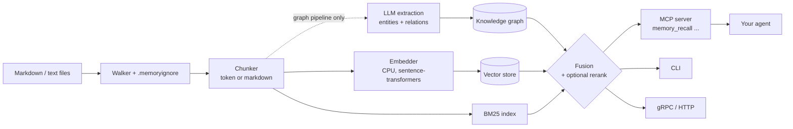

# hars-longterm-memory

**Long-term memory for AI agents: hybrid graph + vector + BM25 search over your own Markdown docs, served to the agent over MCP.**

[Why](#why) | [Features](#features) | [Install](#install) | [60-second quickstart](#60-second-quickstart-no-llm-no-api-key) | [Full setup](#full-setup-llm-graph-pipeline) | [MCP](#connect-an-agent-mcp) | [Agent cheat sheet](#how-an-agent-should-use-it) | [FAQ](#troubleshooting--faq)

---

## Why

- **Agents forget.** Every new session starts from zero; your runbooks, ADRs and notes are not in context.
- **`grep` finds strings, not meaning.** "How do I roll back a release?" will not match a heading called "Recovery procedure".
- **Pure vector search misses exact tokens** (ticket ids, config keys, error codes) and cannot follow relations between documents.

This tool indexes a folder of Markdown/text into a searchable memory and gives the agent
one tool, `memory_recall`, that returns the best chunks **with their location**
(`source_path`, `heading_path`, `start_line`) so the agent can open the exact file and line.

## Features

- **Hybrid retrieval**: dense embeddings + BM25 (+ optional LightRAG knowledge graph, live ripgrep channel, flat dense channel), fused into one ranking.
- **Location metadata** on every chunk: `source_path`, `heading_path`, `start_line` / `end_line`.
- **Structure-aware Markdown chunking** (`HARS_MEMORY_CHUNKER=markdown`): heading breadcrumbs, whole tables and code fences kept intact.
- **Optional reranker**: HTTP (`/v1/rerank`-style endpoint) or local cross-encoder, with automatic fallback to fused order.
- **Lean responses** (`view=lean`, `compact`) to save agent context.
- **Incremental indexing** with content fingerprints; **batch-API indexing** (`memory index-batch`) at half price; cost estimation before you spend.
- **`memory migrate-index`**: back-fill location metadata into older indexes with zero LLM calls.
- **Multi-project isolation, JWT auth, encrypted keystore, RBAC** (off by default).
- **gRPC server** and **HTTP index-job service** in addition to the MCP server and CLI.
- **Evaluation harness** (recall@k, nDCG, MRR) and a CI regression gate.

## Architecture



More detail: [docs/architecture.md](docs/architecture.md).

## Two pipelines - pick one

| | **Corpus pipeline** | **Graph pipeline (LightRAG)** |
|---|---|---|
| Commands | `memory build` / `memory query` | `memory-index` / `memory index-batch`, then `memory recall` and the MCP server |
| LLM needed | **No** | Yes (OpenAI-compatible endpoint, used for entity/relation extraction) |
| Cost | Free (CPU embeddings only) | Pay per chunk (`memory estimate-cost` first); batch mode halves it |
| Gives you | Dense + BM25 fusion, location metadata | Everything above **plus** knowledge graph, `memory_entities` / `memory_related`, MCP integration |
| Use when | Trying it out, small KBs, CI, offline machines | You want agents to use it day to day through MCP |

The MCP server (`memory_recall` etc.) reads a **graph-pipeline index**.

## Install

Requires Python 3.13 and [uv](https://docs.astral.sh/uv/).

```bash
# For users: installs the `memory`, `memory-index`, `memory-mcp` ... commands
uv tool install git+https://github.com/iuriimedvedev-dev/hars-longterm-memory

# For contributors
git clone https://github.com/iuriimedvedev-dev/hars-longterm-memory.git
cd hars-longterm-memory
uv sync --extra dev
uv run memory --help
```

Notes:

- PyTorch is pulled from the **CPU-only** wheel index (configured in `pyproject.toml`), so no CUDA download.
- Embeddings use `unsloth/embeddinggemma-300m` by default. It must be in your local Hugging Face cache
  (the runtime never downloads by default). Fetch it once on a fresh machine:

  ```bash
  uvx --from huggingface_hub hf download unsloth/embeddinggemma-300m
  ```

  Offline machine? Set `HF_HUB_OFFLINE=1`.

## 60-second quickstart (no LLM, no API key)

The repo ships a small fictional knowledge base ("Acme Platform runbook") in
[`examples/sample-kb/`](examples/sample-kb) (7 short Markdown files with nested headings, tables and code blocks).

```bash
git clone https://github.com/iuriimedvedev-dev/hars-longterm-memory.git
cd hars-longterm-memory
uv sync

# 1. Build an index (no LLM involved)
uv run memory build --paths examples/sample-kb --index-dir /tmp/acme-index

# 2. Ask questions
uv run memory query --index-dir /tmp/acme-index --question "how do I roll back a release" --top-k 2
```

Real output (trimmed):

```text
Build complete: 7 documents, 27 chunks
  added=7 changed=0 unchanged=0 deleted=0
  index_dir=/tmp/acme-index

1. [1.0000] examples/sample-kb/deploy.md  (chunk=chunk-bd1da0978bef8bac, channel=fusion)
   # Deployment procedure > ## Rollback

   ## Rollback

   If the error rate exceeds 1% during the canary, roll back immediately:

   ```bash
   acme-deploy rollback --service billing --to previous
   ...
2. [0.5876] examples/sample-kb/deploy.md  (chunk=chunk-e9246038604fc367, channel=fusion)
   # Deployment procedure > ## Standard release
   ...
```

The heading breadcrumb (`Deployment procedure > Rollback`) comes back with each chunk. Other things to try:
`"who owns billing"`, `"what is the session ttl"`, `"database failover steps"`.
`--mode sparse|dense|fusion` selects the channel (default `fusion`).
Re-running `build` is incremental. `memory status` summarises a corpus manifest.

## Full setup (LLM graph pipeline)

### 1. Configure

Copy [`config/.env.example`](config/.env.example) to `.env`, or export variables:

```bash
export HARS_MEMORY_INDEX_DIR=$HOME/.hars-memory/index
export HARS_MEMORY_STAGING_DIR=$HOME/.hars-memory/staging       # where memory_remember writes notes
export HARS_MEMORY_CHUNKER=markdown                            # recommended for docs

# Extraction LLM (used while indexing) - any OpenAI-compatible endpoint
export HARS_MEMORY_EXTRACTOR_BASE_URL=https://api.openai.com/v1
export HARS_MEMORY_EXTRACTOR_MODEL=<a cheap model>
export HARS_MEMORY_LLM_API_KEY=...                             # from your secret store; never commit it

# Query LLM (keyword extraction when the agent supplies none)
export HARS_MEMORY_QUERY_BASE_URL=https://api.openai.com/v1
export HARS_MEMORY_QUERY_MODEL=<a cheap model>
```

Cost tips:

- Use a **small, cheap model** for extraction; it runs once per chunk. A local OpenAI-compatible server (llama.cpp, vLLM, Ollama) works too.
- Temperatures are configurable (`HARS_MEMORY_EXTRACTOR_TEMPERATURE`, `HARS_MEMORY_QUERY_TEMPERATURE`, default `0.1`);
  if your provider rejects a custom temperature, set it to a value it accepts.
- Newer OpenAI models want `max_completion_tokens` instead of `max_tokens`: use `memory index-batch --max-tokens-param max_completion_tokens`.
- **Batch mode** (`memory index-batch`) uses the provider Batch API at about half price.
- Always **estimate first**.

### 2. Estimate, then index

```bash
uv run memory estimate-cost ./my-notes                         # no API calls; prints a $ range
uv run memory-index --paths ./my-notes --dry-run               # walk + count only, no LLM, no writes
uv run memory-index --paths ./my-notes                         # incremental; --full forces a re-index
```

Half-price batch route (resumable, with a spending cap):

```bash
uv run memory index-batch collect --dry-run --paths ./my-notes  # builds prompts, prints estimated $, writes nothing
uv run memory index-batch run --paths ./my-notes --max-cost 5.00
```

Phases: `collect`, `submit`, `status`, `apply`, `run` (all of it), `cancel`, `compare`.
`--max-cost` (default 0.50 USD) aborts if the estimate is higher. For a first try on the sample KB
the dry-run reports 7 requests, about 23k input tokens, roughly $0.004 at batch prices.

### 3. Query from the CLI

```bash
uv run memory recall "who owns the billing service?" --mode hybrid --top-k 10
uv run memory recall "billing owner" --ll-keywords billing --hl-keywords ownership --context-only --json
```

## Connect an agent (MCP)

Claude Code:

```bash
claude mcp add hars-memory \
  -e HARS_MEMORY_INDEX_DIR=$HOME/.hars-memory/index \
  -e HARS_MEMORY_STAGING_DIR=$HOME/.hars-memory/staging \
  -e HARS_MEMORY_QUERY_BASE_URL=https://api.openai.com/v1 \
  -e HARS_MEMORY_QUERY_MODEL=<model> \
  -- memory-mcp
```

(If you installed with `uv tool install`, `memory-mcp` is on your PATH. From a clone use
`-- uv run --project /path/to/hars-longterm-memory memory-mcp`.)

Any other MCP client (stdio):

```json
{
  "mcpServers": {
    "hars-memory": {
      "command": "memory-mcp",
      "env": {
        "HARS_MEMORY_INDEX_DIR": "/home/me/.hars-memory/index",
        "HARS_MEMORY_STAGING_DIR": "/home/me/.hars-memory/staging",
        "HARS_MEMORY_QUERY_BASE_URL": "https://api.openai.com/v1",
        "HARS_MEMORY_QUERY_MODEL": "<model>"
      }
    }
  }
}
```

## How an agent should use it

### `memory_recall` arguments

| Arg | Meaning |
|---|---|
| `question` | Natural-language question (required) |
| `ll_keywords` | Specific entities / codes / names, e.g. `["SESSION_TTL_MINUTES"]` |
| `hl_keywords` | Themes / concepts, e.g. `["session expiry"]` |
| `mode` | `hybrid` (default), `local`, `global`, `naive` |
| `top_k` | Number of results, 1-50 (default 6) |
| `view` | `lean` drops the large `context` blob and duplicates; keeps chunks and locations |
| `compact` | Omit text that repeats other fields |
| `context_only` | Default `true`: return context, the calling agent writes the answer |
| `debug` | Adds `fused_chunks`, latency and raw details |

### Tips

1. **Always supply `ll_keywords` / `hl_keywords`.** With no keywords the mode becomes `naive` automatically; supplied keywords also skip the keyword-extraction LLM call.
2. Read `hybrid.fused_chunks`: each has `source_path`, `heading_path`, `start_line`.
3. Check `hybrid.confidence` (look for `low_confidence`); if low, rephrase or add keywords.
4. **Then open the file at `start_line`** to read the authoritative text instead of trusting the snippet.
5. Prefer `view=lean` to save context.

### Which tool when

| Tool | Use it to |
|---|---|
| `memory_recall` | Find relevant knowledge (the main tool) |
| `memory_remember` | Save a durable note (written to the staging dir, searchable after consolidation) |
| `memory_consolidate` | Re-index new/changed files (admin) |
| `memory_forget` | Purge documents by date (admin) |
| `memory_status` | Check index health and freshness |
| `memory_list_projects` | See available projects |
| `memory_entities` / `memory_related` | Explore the knowledge graph: find an entity, then walk its neighbours |

Also available: `memory_inspect_entity`, `memory_upsert_document`, `memory_delete_document`, `memory_sync_status`.
Full reference: [docs/mcp-tools.md](docs/mcp-tools.md).

## Key settings

All settings are `HARS_MEMORY_*` environment variables. The important ones:

| Variable | Default | Purpose |
|---|---|---|
| `HARS_MEMORY_INDEX_DIR` | required | Where the index lives |
| `HARS_MEMORY_STAGING_DIR` | required (MCP) | Where `memory_remember` writes notes |
| `HARS_MEMORY_EXTRACTOR_BASE_URL` / `_MODEL` | `http://localhost:8080/v1` / none | Indexing LLM |
| `HARS_MEMORY_QUERY_BASE_URL` / `_MODEL` | `http://localhost:8081/v1` / none | Query-time LLM |
| `HARS_MEMORY_LLM_API_KEY` | `not-needed` | Key for hosted providers |
| `HARS_MEMORY_CHUNKER` | `token` | `markdown` for structure-aware chunks |
| `HARS_MEMORY_EMBED_MODEL` | `unsloth/embeddinggemma-300m` | Embedder (changing it requires a full re-index) |
| `HARS_MEMORY_EMBED_LOCAL_FILES_ONLY` | `1` | Set `0` to allow model downloads |
| `HARS_MEMORY_HYBRID_ALPHA` | `0.5` | Dense vs BM25 weight |
| `HARS_MEMORY_RECALL_VIEW` | `full` | Set `lean` to default to lean responses |
| `HARS_MEMORY_RERANK_BACKEND` | unset | `off`, `local` or `http` |
| `HARS_MEMORY_VECTOR_STORAGE` | `NanoVectorDBStorage` | `QdrantVectorDBStorage` for production |

Everything else: [docs/configuration.md](docs/configuration.md).

## Operations

- **Update incrementally**: re-run `memory-index --paths ...` (new files only), add `--refresh-changed` to also re-index files edited in place, or call `memory_consolidate`.
- **Old index without locations?** `memory migrate-index --index-dir ... --root <kb-root> --dry-run`, then without `--dry-run`. No LLM calls, vectors are not re-embedded.
- **Back up**: `memory export backup.tar.gz` and `memory import backup.tar.gz --index-dir ...`.
- **Stop the MCP server before rewriting the index** (re-index, migrate, import); restart it afterwards.
- **Changing the embedder or chunker** means a full re-index (`memory-index --full`, new `--index-dir` recommended).

## Troubleshooting / FAQ

- **"Could not load embedding model ... from local cache".** The model is not in the cache this code looks at. Download it
  (`uvx --from huggingface_hub hf download unsloth/embeddinggemma-300m`), and if it still fails with the graph pipeline set
  `HF_HOME=$HOME/.cache/huggingface`. Use `HF_HUB_OFFLINE=1` on air-gapped machines.
- **Dimension mismatch errors after changing `HARS_MEMORY_EMBED_MODEL`.** Vectors of different sizes cannot mix; re-index into a fresh `--index-dir`.
- **Results look weak and no keywords were passed.** Without keywords the mode falls back to `naive`. Pass `ll_keywords` / `hl_keywords`.
- **Controlling cost.** Run `memory estimate-cost`, use `index-batch` with `--max-cost`, keep `HARS_MEMORY_MAX_GLEANING` low, and rely on incremental runs.
- **Non-English content.** `HARS_MEMORY_EXTRACTION_LANGUAGE` (default `English`) sets the language the extraction LLM uses; pick an embedder (`HARS_MEMORY_EMBED_MODEL`) that supports your language.
- **Is it safe to expose?** Auth is off by default; see [docs/auth.md](docs/auth.md) before running the gRPC/HTTP services on a network.

## Documentation

| Doc | Topic |
|---|---|
| [docs/README.md](docs/README.md) | Documentation index |
| [docs/architecture.md](docs/architecture.md) | Modules and data flow |
| [docs/configuration.md](docs/configuration.md) | Every environment variable |
| [docs/indexing.md](docs/indexing.md) | Sources, chunkers, incremental and batch indexing |
| [docs/mcp-tools.md](docs/mcp-tools.md), [docs/mcp-reference.md](docs/mcp-reference.md) | MCP tools |
| [docs/retrieval.md](docs/retrieval.md) | Hybrid retrieval, reranking, tuning |
| [docs/evaluation.md](docs/evaluation.md) | Metrics and eval cases |
| [docs/auth.md](docs/auth.md) | Keystore, JWT, projects, RBAC |
| [docs/index-service.md](docs/index-service.md) | HTTP index-job service and SDK |
| [docs/grpc-reference.md](docs/grpc-reference.md) | gRPC API |

## Contributing

See [CONTRIBUTING.md](CONTRIBUTING.md). Dev loop: `uv sync --extra dev`, `uv run pytest -q`, `uv run ruff check`.
Security issues: [SECURITY.md](SECURITY.md). History: [CHANGELOG.md](CHANGELOG.md).

## License

**License: not yet specified - all rights reserved until the owner adds a LICENSE.**
