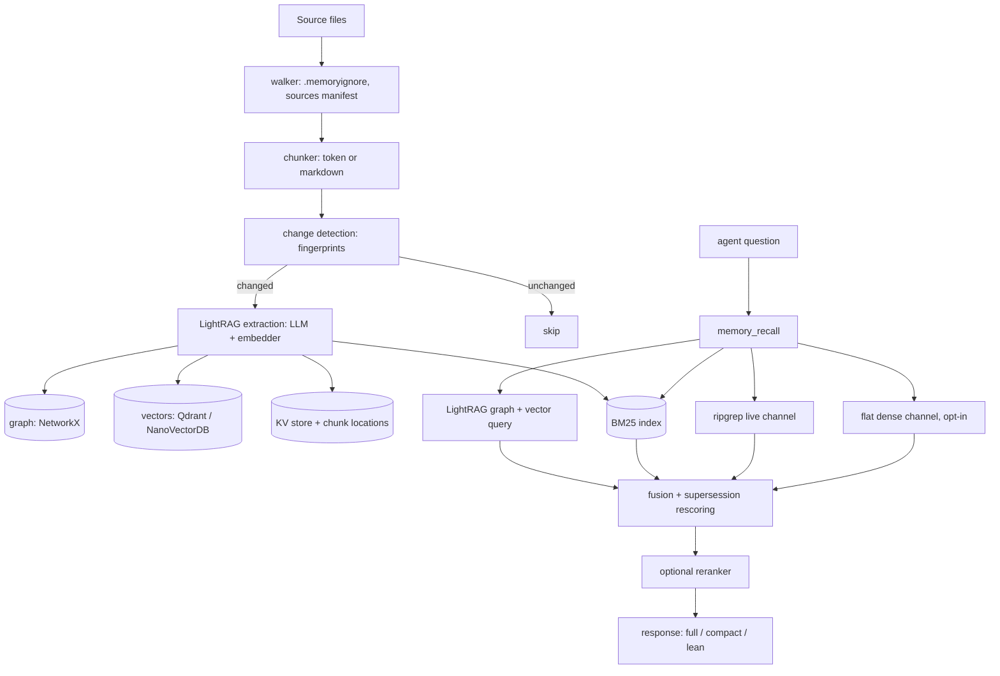

# Architecture

## Data flow

1. **Ingest.** The walker collects files (honouring `.memoryignore` and the
   optional knowledge-sources manifest). The chunker splits them (`token` or
   structure-aware `markdown`). Change detection compares content fingerprints so
   only new or modified documents are sent on.
2. **Embed and extract.** LightRAG asks the extractor LLM for entities and
   relations per chunk, embeds chunks on CPU, and writes the graph, vectors and
   KV store. A BM25 index is built over the same chunks.
3. **Retrieve.** `memory_recall` queries the graph/vector store, BM25, and (by
   default) a ripgrep channel over live files, fuses the ranked lists,
   demotes superseded documents and optionally reranks the head of the list.
4. **Serve.** The result is exposed through MCP tools, the CLI, gRPC, or the
   HTTP index-job service / Python SDK.

## Module map

| Path | Role |
|---|---|
| `hars_memory/cli.py` | `memory` CLI and console-script entrypoints |
| `hars_memory/mcp_server.py` | MCP stdio server: all `memory_*` tools, recall orchestration |
| `hars_memory/ingest/` | `walker` (file discovery), `chunker`, `change_detection`, `sources` (manifest), `api` (programmatic `ingest_documents()`), `batch` (Batch API extraction), `migrate` (chunk-metadata back-fill), `document` |
| `hars_memory/server/` | `index` (indexing entrypoint), `lightrag_init` (wires LLMs/embedder/storage), `embedder`, `logging_setup`, `legacy_env_guard` |
| `hars_memory/retrieval/` | `bm25_index`, `flat_index` (flat dense), `ripgrep_channel`, `fusion`, `supersession`, `http_rerank`, `chunk_location`, `tokenizer` |
| `hars_memory/corpus/` | LLM-free CPU build/query pipeline (sparse / dense / fusion), used by `memory build` and `memory query` |
| `hars_memory/schema/` | Entity/relation type schema (`default_schema.yaml`) and extraction prompt |
| `hars_memory/eval/` | Metrics, regression gate, strategy benchmark, gold-question checks |
| `hars_memory/auth/` | Keystore, JWT, RBAC policy (see [auth.md](auth.md)) |
| `hars_memory/projects/` | Multi-project registry and metadata |
| `hars_memory/catalog/` | Document catalog store |
| `hars_memory/grpc/` | gRPC server, client and generated stubs (`proto/hars_memory.proto`) |
| `hars_memory/service/` | FastAPI index-job service, DB models, worker, artifact stores |
| `hars_memory/sdk.py`, `strategies.py` | Python SDK for the HTTP service; validated index strategies |

## Storage

| Store | Backend | Location |
|---|---|---|
| Graph | NetworkX (GraphML) | `HARS_MEMORY_INDEX_DIR` |
| Vectors | `NanoVectorDBStorage` (default) or `QdrantVectorDBStorage` | index dir / Qdrant |
| BM25 | file-based, atomic save | `HARS_MEMORY_BM25_CACHE_DIR` (default: sibling `bm25_cache/`) |
| KV store, LLM response cache, chunk locations | JSON files | `HARS_MEMORY_INDEX_DIR` |
| Fingerprints | JSON sidecar | `<index>/doc_fingerprints.json` |

Chunk ids are `md5(chunk text)`. Changing the chunker or chunk sizes therefore
changes ids and requires re-extraction of affected documents.

## Projects

Every tool accepts a `project` argument (default `default`). Each project has its
own index directory, staging directory, BM25 cache and Qdrant collection prefix.
See [auth.md](auth.md).
