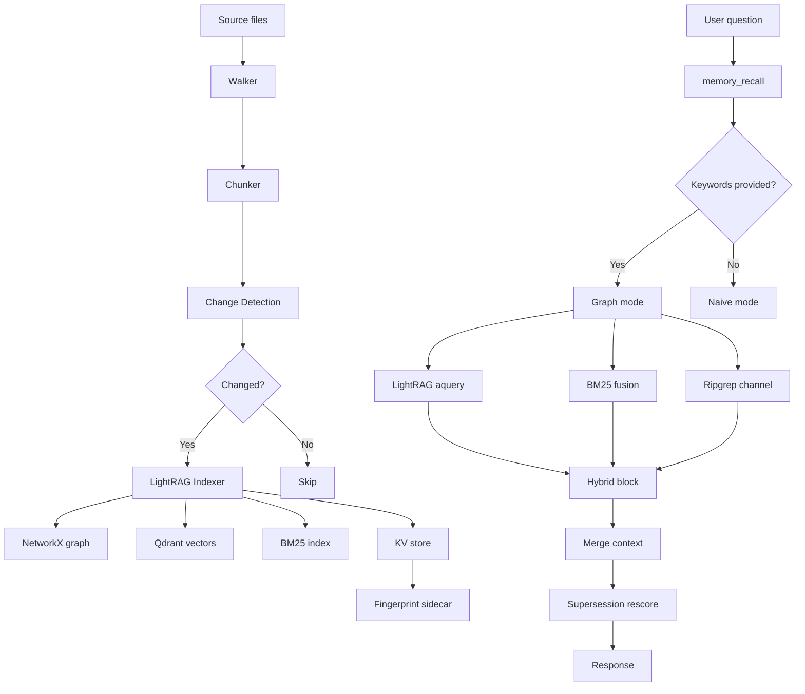

# Architecture

## Module map

```
hars_memory/
  cli.py                  — console-script entrypoints (memory-index, memory-mcp,
                            hars-longterm-memory-mcp, memory-eval-battle, memory)
  mcp_server.py           — MCP server: 7 tools, ~2900 lines, the primary
                            read surface for an AI agent
  ingest/                 — document ingestion pipeline
    walker.py             — glob filter + .memoryignore-aware file walker
    chunker.py            — Markdown-aware chunking (H2/H3 boundaries, breadcrumbs,
                            code block protection) + character-level overlap fallback
    change_detection.py   — content-fingerprint sidecar for incremental reindex
    api.py                — public ingest_documents() API for non-filesystem sources
  server/                 — index server and LightRAG wiring
    index.py              — CLI entrypoint (GPU-guarded reindex)
    lightrag_init.py      — wires LightRAG to configured embedder/extractor/query LLM
    embedder.py           — CPU embedding wrapper
    reranker.py           — Cross-Encoder reranking (via asyncio.to_thread)
    legacy_env_guard.py   — fail-closed on legacy env prefixes
    logging_setup.py      — structured JSON query event logging
  retrieval/              — additive retrieval channels
    bm25_index.py         — BM25 sparse index (atomic save via temp dir + os.replace)
    flat_dense.py         — flat-dense fallback index (default off)
    ripgrep_channel.py    — ripgrep live-worktree search (via asyncio.to_thread)
    fusion.py             — dense+sparse fusion (alpha-weighted)
    supersession.py       — supersession-aware rescoring
  corpus/                 — LLM-free, CPU-only build/query pipeline (separate from
                            LightRAG graph pipeline, no LLM calls at all)
  schema/                 — entity/relation type schema
    default_schema.yaml   — generic default schema (Concept/Document/Decision/...)
  eval/                   — evaluation and benchmarks
    check.py              — gold-question harness
    battle.py             — generated retrieval battle test
    regression.py         — regression gate (memory regress)
    metrics.py            — retrieval metrics (Recall@k, nDCG@k, MRR, citation F1)
    strategy_bench.py     — declarative strategy benchmark matrix
  service/                — HTTP index-job service
    server.py             — FastAPI app
    models.py             — SQLAlchemy models
    worker.py             — async job worker with leases
    engines.py            — index engine registry
    artifact_store.py     — file/S3 artifact store abstraction
  sdk.py                  — synchronous HTTP client for create/extend/poll/download
  strategies.py           — validated index/search strategies and YAML matrices
  scripts/                — maintenance tools
    cleanup_kb.py         — index-only maintenance
    qdrant_transplant.py  — one-off vector migration tool
cortex-scripts/           — Cortex consumer scripts (not part of installed package)
```

## Data flow



## Query pipeline

The `memory_recall` tool orchestrates up to 4 retrieval channels:

### 1. LightRAG graph channel (always on)
- Entity/relation graph traversal
- Modes: `local` (entity neighbourhood), `global` (community themes), `hybrid` (both)
- Uses `ll_keywords`/`hl_keywords` when provided — skips the keyword-extraction LLM call
- Falls back to `naive` (pure vector similarity) when no keywords are supplied

### 2. BM25 sparse fusion channel (always on)
- Sparse keyword retrieval over the indexed chunk store
- Exact identifier matching (e.g. `A2S32`, `hyp:7f62cfb4`) — dense embeddings miss these
- Alpha-weighted fusion with dense results (`HARS_MEMORY_HYBRID_ALPHA`, default 0.5)
- Atomic index save via temp dir + `os.replace` (no half-written index reads)
- BM25 query runs in `asyncio.to_thread` — does not block the event loop

### 3. Ripgrep live-worktree channel (default on)
- Searches the LIVE filesystem (not the index) for exact identifiers
- Catches files added/edited since the last consolidation
- Uses `query_terms` from the question AND `ll_keywords` — supplying keywords improves recall
- Runs in `asyncio.to_thread` — does not block the event loop
- Results are appended AFTER the top_k dense/sparse results, never displacing them

### 4. Flat-dense channel (default off)
- Additive channel covering chunks in the raw chunk store but missing/stale in the primary vector store
- Pays CPU embed cost per query
- Enable via `HARS_MEMORY_FLAT_CHANNEL=1` when index/vector-store drift is suspected

### Context merging

When `context_only=true` (default) and `context_priority=merged` (default):

1. LightRAG's own `context` string is parsed into individual document chunks
2. BM25 fusion results are interleaved with LightRAG chunks in round-robin order
3. Supersession-aware rescoring re-ranks the merged list (superseded/outdated docs rank lower)
4. Fusion-only documents are injected using their `snippet` (truncated content)
5. Each chunk includes a `section` field with the breadcrumb heading chain for section-level citation accuracy

## Index pipeline

### Ingestion flow
1. **Walker** (`ingest/walker.py`): globs files, applies `.memoryignore` rules
2. **Chunker** (`ingest/chunker.py`): splits by H2/H3 heading boundaries, adds breadcrumbs, protects code blocks and tables. Falls back to character-level overlap chunking for non-Markdown
3. **Change detection** (`ingest/change_detection.py`): compares content fingerprints against a sidecar store. Only changed/new files proceed to indexing
4. **LightRAG indexer**: extracts entities/relations (via configured LLM), embeds chunks (CPU), stores vectors in Qdrant and graph in NetworkX
5. **BM25 indexer**: builds sparse index over chunks
6. **Fingerprint store**: saves content hashes for future incremental runs
7. **Deleted doc GC**: documents removed from the filesystem are deleted from all stores (LightRAG, BM25, fingerprint)

### Storage backends

| Store | Backend | Location |
|---|---|---|
| Graph | NetworkX (`.graphml` + JSON) | `HARS_MEMORY_INDEX_DIR` |
| Vectors | Qdrant (default) or NanoVectorDB | Configurable via `HARS_MEMORY_VECTOR_STORAGE` |
| Sparse index | BM25s (file-based) | `HARS_MEMORY_INDEX_DIR` |
| KV store | JSON files | `HARS_MEMORY_INDEX_DIR` |
| Fingerprints | JSON sidecar | `HARS_MEMORY_INDEX_DIR` |

## GPU guard

The GPU guard is a **consumer hook point** — this package ships no default:

- `HARS_MEMORY_GPU_GUARD_SCRIPT_PATH` (optional): path to a Python file exposing
  `assert_gpu_free(api_base_url)`. Loaded dynamically via `importlib`
- If unset: `memory_consolidate` and `server/index.py` perform NO GPU-concurrency
  check and proceed unconditionally
- Query tools (`memory_recall`, `memory_status`, etc.) never call the GPU guard —
  CPU embeddings make them always available even mid-training
- Cortex supplies its own guard at `tools/memory-config/scripts/gpu_guard.py`

## Entity schema

This package ships a generic default entity schema at
`hars_memory/schema/default_schema.yaml`:

| Entity types | Relation types |
|---|---|
| Concept, Document, Decision, Event, Person, Tool, Task | relates_to, produces, depends_on, supersedes, documented_in |

Override via `HARS_MEMORY_ENTITY_SCHEMA_PATH` for domain-specific typing.

## Index service (HTTP)

The optional HTTP index service (`hars-longterm-memory-server`) provides a
tenant-scoped job-based API:

- `POST /v1/index-jobs` — create an index job (files, engine, idempotency key)
- `GET /v1/index-jobs/{id}` — poll job status
- `POST /v1/index-jobs/{id}/cancel` — cancel a running job
- `GET /v1/indexes/{id}/latest` — latest version descriptor
- `GET /v1/indexes/{id}/versions/{version}` — specific version descriptor
- `GET /v1/indexes/{id}/versions/{version}/download` — download artifact tarball
- `GET /health` — service health check

Engines: `corpus` (LLM-free, CPU-only), `lightrag` (full graph indexer).

## Evaluation

| Metric | Description | Implemented in |
|---|---|---|
| Recall@k | Keyword recall at k results | `eval/metrics.py` |
| NDCG@k | Normalised Discounted Cumulative Gain | `eval/metrics.py` |
| MRR | Mean Reciprocal Rank | `eval/metrics.py` |
| File recall | Correct files in top-k | `eval/metrics.py` |
| Citation F1 | Citation accuracy against ground-truth | `eval/metrics.py` |
| Latency | Query latency (mean, p50, p90, p95, p99) | `bench_compare.py` |
| Supersession error | Rate of superseded docs ranked above superseding ones | `eval/metrics.py` |