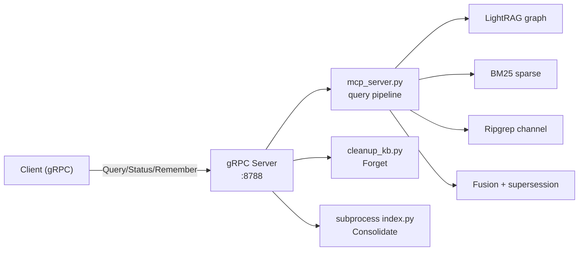

# gRPC reference

The `hars-longterm-memory` package exposes a gRPC service on a configurable TCP
port (default `8788`). The service mirrors the 7 MCP tools as gRPC RPCs, using
the same underlying query pipeline from `mcp_server.py`.

## Service definition

The proto definition is at `proto/hars_memory.proto` with generated Python code
in `hars_memory/grpc/`.

## RPC overview

| RPC | MCP equivalent | Purpose |
|---|---|---|
| `Query` | `memory_recall` | Query the knowledge graph |
| `Status` | `memory_status` | Index health report |
| `Remember` | `memory_remember` | Save a note into staging |
| `SearchEntities` | `memory_entities` | Search graph entities by name |
| `RelatedEntities` | `memory_related` | N-hop subgraph traversal |
| `Consolidate` | `memory_consolidate` | Trigger incremental reindex |
| `Forget` | `memory_forget` | Purge stale documents |

## Starting the server

```bash
# Via CLI entrypoint
hars-longterm-memory-grpc

# Or via uv
uv run hars-longterm-memory-grpc
```

### Configuration

| Env var | Default | Description |
|---|---|---|
| `HARS_MEMORY_GRPC_HOST` | `0.0.0.0` | Bind address |
| `HARS_MEMORY_GRPC_PORT` | `8788` | Bind port |
| `HARS_MEMORY_GRPC_MAX_WORKERS` | `10` | Thread pool size |
| `HARS_MEMORY_GRPC_MAX_MESSAGE_SIZE` | `4194304` | Max message size (4 MB) |
| `HARS_MEMORY_API_KEYS_JSON` | — | JSON dict of `{key: name}` for API key auth |

## Client usage

### Synchronous

```python
from hars_memory.grpc.client import HarsMemoryGrpcClient

with HarsMemoryGrpcClient("localhost:8788") as client:
    resp = client.query("What is Kubernetes?", top_k=20)
    if resp.ok:
        print(resp.context)
    # Use resp.hybrid for the hybrid fusion block
    # Use resp.citations for section-level citations
```

### Async

```python
from hars_memory.grpc.client import AsyncHarsMemoryGrpcClient

async with AsyncHarsMemoryGrpcClient("localhost:8788") as client:
    resp = await client.query("What is Kubernetes?")
    print(resp.context)
```

### With API key

```python
client = HarsMemoryGrpcClient("localhost:8788", api_key="my-secret-key")
```

### Other RPCs

```python
# Status
status = client.status()
print(status.data)

# Remember
resp = client.remember("my-note", "Important info", tags=["k8s", "gcp"])

# Search entities
resp = client.search_entities("GKE", limit=5)

# Related entities
resp = client.related_entities("hyp:123")

# Consolidate (dry-run by default)
resp = client.consolidate(paths=[".plans", "docs"], dry_run=True)

# Forget (dry-run by default)
resp = client.forget(before="2026-06-01", protect=[".*important.*"])
```

## Health check

The server implements the standard gRPC health checking protocol
(`grpc.health.v1.Health`). Use `grpc_health_probe` or any gRPC health client:

```bash
grpc_health_probe -addr=localhost:8788
```

## Architecture



## Error handling

All RPCs return `ok=false` with an `error` string on failure. Standard gRPC
status codes are used:

| Code | Scenario |
|---|---|
| `UNAUTHENTICATED` | Invalid API key (when `HARS_MEMORY_API_KEYS_JSON` is set) |
| `INTERNAL` | Query pipeline failure (index not built, LLM unavailable) |
| `INVALID_ARGUMENT` | Missing required fields (empty question, no cutoff) |