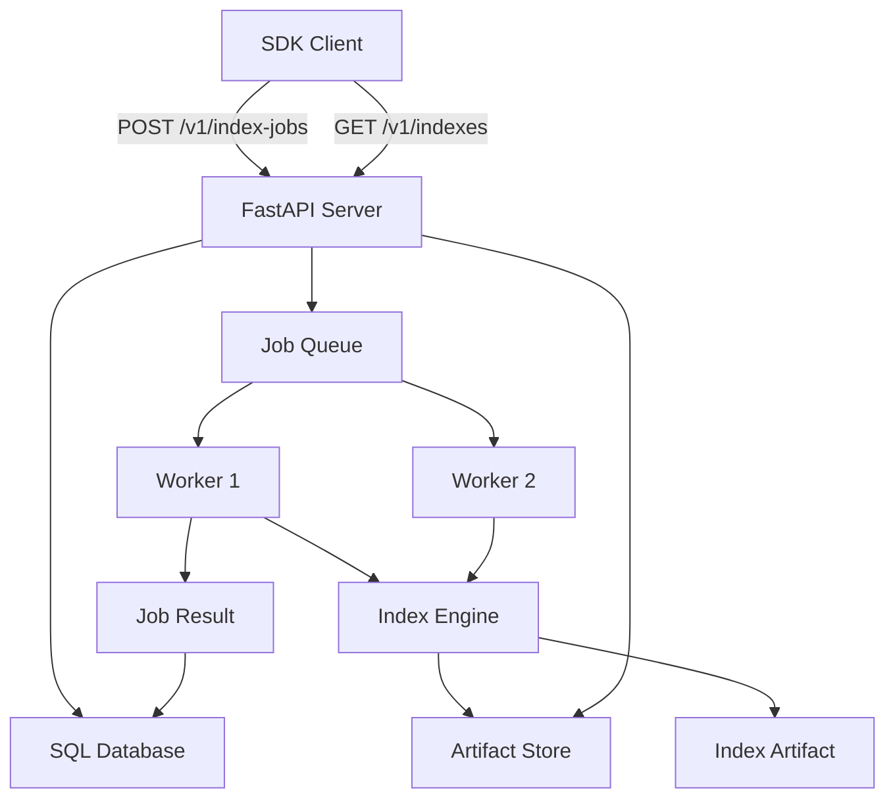

# HTTP index service

The optional HTTP index service (`hars-longterm-memory-server`) provides a
tenant-scoped, job-based API for creating, extending, and downloading index
artifacts. It is built on FastAPI with SQLAlchemy (SQLite or Postgres) and
supports pluggable artifact stores (filesystem or S3).

## Quick start

```bash
# Install with server extras
uv sync --extra server

# Set required env vars
export HARS_MEMORY_API_KEYS_JSON='{"replace-with-a-secret-key":"tenant-a"}'
export HARS_MEMORY_SERVICE_DATABASE_URL='sqlite:///./hars-memory-service.sqlite3'
export HARS_MEMORY_ARTIFACT_STORE_URL="file://$(pwd)/hars-memory-artifacts"

# Start the server
uv run hars-longterm-memory-server
```

## API reference

### `GET /health`

Service health check. Returns `{"status": "ok"}`.

### `POST /v1/index-jobs`

Create a new index job.

**Request body:**

```json
{
  "file_paths": ["docs/architecture.md", "notes.txt"],
  "engine": "corpus",
  "idempotency_key": "architecture-v1",
  "strategy_name": null,
  "strategy_options": {}
}
```

| Field | Type | Default | Description |
|---|---|---|---|
| `file_paths` | `string[]` | **required** | Paths to files to index |
| `engine` | `enum` | `corpus` | Index engine: `corpus` (CPU-only, LLM-free) or `lightrag` (full graph indexer) |
| `idempotency_key` | `string` | — | Optional. Re-sending the same key returns the existing job |
| `strategy_name` | `string` | — | Strategy name from `IndexStrategy` registry |
| `strategy_options` | `object` | `{}` | Strategy-specific options |

**Response:**

```json
{
  "id": "uuid",
  "status": "pending",
  "engine": "corpus",
  "index_id": null,
  "created_at": "2026-08-25T14:30:00Z"
}
```

### `GET /v1/index-jobs/{id}`

Poll job status.

**Response:**

```json
{
  "id": "uuid",
  "status": "completed",
  "engine": "corpus",
  "index_id": "uuid",
  "error": null,
  "created_at": "2026-08-25T14:30:00Z",
  "completed_at": "2026-08-25T14:30:05Z",
  "manifest": {
    "index_version": 1,
    "strategy_snapshot": {},
    "documents": 5,
    "chunks": 120,
    "portable": true
  }
}
```

Status values: `pending`, `running`, `completed`, `failed`, `cancelled`.

### `POST /v1/index-jobs/{id}/cancel`

Cancel a running job. Only jobs with status `pending` or `running` can be cancelled.

### `GET /v1/indexes/{index_id}/latest`

Get the latest version descriptor for an index.

### `GET /v1/indexes/{index_id}/versions/{version}`

Get a specific version descriptor.

### `GET /v1/indexes/{index_id}/versions/{version}/download`

Download the index artifact tarball. Returns a stream with `Content-Disposition: attachment` and a `X-Checksum-Sha256` header.

## SDK usage

```python
from pathlib import Path
from hars_memory.sdk import HarsMemoryClient

with HarsMemoryClient("http://127.0.0.1:8787", "your-api-key") as client:
    # Create an index job
    job = client.create_index(
        [Path("docs/architecture.md"), Path("notes.txt")],
        engine="corpus",
        idempotency_key="architecture-v1",
    )

    # Wait for completion
    completed = client.wait_job(job.id)

    # Get latest version
    version = client.get_latest_index(completed.index_id)

    # Download artifact
    client.download_artifact(completed.index_id, Path("architecture-index.tar.gz"))

    # Extend an existing index
    extension = client.extend_index(
        completed.index_id,
        {"new-facts.md": "# New facts\n\nAdditional evidence."},
        expected_version=version.version,
        idempotency_key="architecture-v2",
    )
    client.wait_job(extension.id)
```

## Deployment

### Docker

The service is available as a Docker image from the GitLab Container Registry:

```bash
docker pull registry.gitlab.com/hars/hars-longterm-memory:latest
docker run --rm -p 8787:8787 \
  -e HARS_MEMORY_API_KEYS_JSON='{"key":"tenant-a"}' \
  -v hars-memory-data:/data \
  registry.gitlab.com/hars/hars-longterm-memory:latest
```

Build locally:

```bash
docker build -f Dockerfile.service -t hars-memory-service .
```

### Configuration

| Variable | Default | Description |
|---|---|---|
| `HARS_MEMORY_API_KEYS_JSON` | — | **Required.** JSON object mapping API keys to tenant IDs. Server fails closed when absent |
| `HARS_MEMORY_SERVICE_HOST` | `0.0.0.0` | Bind address |
| `HARS_MEMORY_SERVICE_PORT` | `8787` | HTTP port |
| `HARS_MEMORY_SERVICE_DATABASE_URL` | `sqlite:///./hars-memory-service.sqlite3` | Job database. Use `postgresql+psycopg://` for production |
| `HARS_MEMORY_ARTIFACT_STORE_URL` | `file:///./hars-memory-artifacts` | Artifact store. Use `s3://bucket/prefix` for cloud |
| `HARS_MEMORY_S3_ENDPOINT_URL` | — | Custom S3 endpoint (e.g. MinIO) |
| `HARS_MEMORY_S3_REGION` | — | S3 region |
| `HARS_MEMORY_WORKER_SCRATCH_DIR` | `/tmp/hars-memory-worker-scratch` | Scratch directory for workers |
| `HARS_MEMORY_WORKER_POLL_SECONDS` | `5` | Worker poll interval |
| `HARS_MEMORY_WORKER_LEASE_SECONDS` | `30` | Job lease duration |

### Production considerations

- **Database**: use Postgres, not SQLite, for concurrent worker access
- **Artifact store**: use S3-compatible storage for durability and multi-node access
- **Workers**: multiple workers can run concurrently — job leases prevent duplicate work
- **API keys**: rotate regularly. Each key maps to a tenant ID for isolation
- **Health checks**: configure the Docker `HEALTHCHECK` (already in `Dockerfile.service`)

## Engines

### `corpus` (default)

- CPU-only, no LLM calls
- Builds a portable sparse/fusion corpus index
- Suitable for CI/CD pipelines and development

### `lightrag`

- Runs the full LightRAG indexer (entity extraction, embedding, graph construction)
- Requires configured extractor/query LLM endpoints
- Deploy the server on a GPU machine
- Produces a portable index unless Qdrant-backed (then `portable=false` in manifest)

## Architecture

